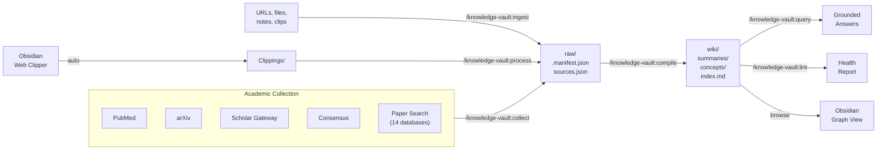
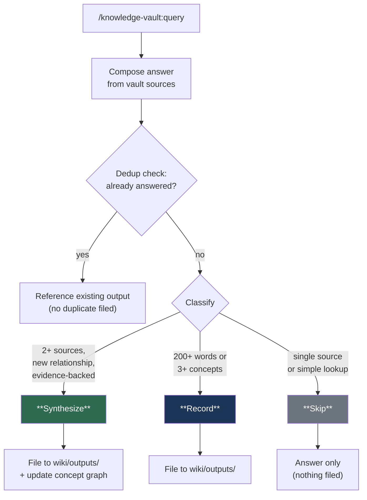
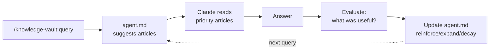

<p align="center">
  <h1 align="center">Knowledge Vault</h1>
  <p align="center">
    <strong>A local, LLM-powered knowledge base with academic collection via MCP.</strong>
    <br />
    Collect from research databases. Ingest sources. Compile a wiki. Query your knowledge. Browse in Obsidian.
  </p>
  <p align="center">
    <a href="LICENSE"></a>
    <a href="https://docs.anthropic.com/en/docs/claude-code"></a>
    <a href="https://obsidian.md"></a>
    <a href="https://modelcontextprotocol.io"></a>
  </p>
</p>

<br />

> Built on ideas from [Andrej Karpathy's LLM knowledge base approach](https://x.com/karpathy/status/1906365823148564901), the [agno-agi/pal](https://github.com/agno-agi/pal) architecture, and the [farzaa/wiki](https://github.com/farzaa/wiki) pattern.

<br />

## What It Does

Knowledge Vault is a [Claude Code](https://docs.anthropic.com/en/docs/claude-code) plugin that turns any project directory into a structured knowledge base. v2 adds batch academic collection from research databases via MCP servers.



**Claude maintains all wiki content. You browse and query -- never edit directly.**

<br />

## Install

### New install

**Step 1** — Add the marketplace (one time only):

```bash
/plugin marketplace add psypeal/claude-knowledge-vault
```

**Step 2** — Install the plugin:

```bash
/plugin install knowledge-vault@claude-knowledge-vault
```

**Step 3** — Reload:

```bash
/reload-plugins
```

No config, no dependencies, no API keys.

### Choose installation scope

By default, `/plugin install` installs at **user scope** (available in all projects). To install for a specific project only, use the interactive UI:

1. Run `/plugin` and go to the **Discover** tab
2. Select `knowledge-vault` and press Enter
3. Choose your scope:

| Scope | What it does | Best for |
|:------|:-------------|:---------|
| **User** | Active in all projects (default) | If you want the vault available everywhere |
| **Project** | Active in this project, shared with collaborators | Recommended for team projects |
| **Local** | Active in this repo for you only, not shared | Personal use in shared repos |

### Migrating from v1 (skill)

Existing vaults are untouched — the `.vault/` directory format is unchanged.

```bash
# 1. Remove the old skill
rm -rf ~/.claude/skills/knowledge-vault
```

Then in Claude Code:

```bash
/plugin marketplace add psypeal/claude-knowledge-vault
```

```bash
/plugin install knowledge-vault@claude-knowledge-vault
```

```bash
/reload-plugins

# 3. Done — your existing .vault/ directories work as-is
```

See [Migration](#migration) for full details.

<br />

## Quick Start

```
> /knowledge-vault:init
  Vault initialized at .vault/

  Let me configure your vault preferences.

  What domain is this vault for?
> Neuroimaging and neurodegeneration research

  Preferences saved to .vault/preferences.md

  Tip: Run /knowledge-vault:setup-sources to configure academic databases.

> /knowledge-vault:setup-sources
  Detected:
    PubMed (Claude.ai built-in)         active
    Scholar Gateway (Claude.ai built-in) active

  Available to add:
    Consensus       claude mcp add --transport http consensus https://mcp.consensus.app/mcp
    arXiv           claude mcp add arxiv-mcp-server -- uvx arxiv-mcp-server ...
    Paper Search    claude mcp add paper-search -- npx -y paper-search-mcp-nodejs

  Which servers would you like to add?
> Consensus and arXiv

  Added 2 servers. Sources saved to .vault/sources.json

> /knowledge-vault:collect tau PET imaging neurodegeneration --since 2023
  Searching PubMed, Scholar Gateway, Consensus, arXiv...

  | # | Title                                         | Source   | Date | Type   |
  |---|-----------------------------------------------|----------|------|--------|
  | 1 | Tau PET imaging in early Alzheimer's disease   | PubMed   | 2024 | paper  |
  | 2 | Longitudinal tau accumulation in subcortical... | Consensus| 2023 | paper  |
  | 3 | Second-generation tau tracers: a review         | arXiv    | 2024 | review |

  Which to ingest? (all / 1,3 / none)
> all

  Ingested 3 sources. 3 pending compilation.

> /knowledge-vault:compile
  Compiled 3 sources. Extracted 7 concepts:
  tau-pet-imaging, neurodegeneration, alzheimers-disease, tau-tracers,
  subcortical-tau, longitudinal-imaging, amyloid-tau-interaction

> /knowledge-vault:query What is the current evidence for second-generation tau tracers?
  Based on the vault: Second-generation tau PET tracers (e.g., [18F]MK-6240,
  [18F]PI-2620) show improved off-target binding profiles compared to
  first-generation [18F]AV-1451. Three vault sources report higher specificity
  for neurofibrillary tau in Braak stages III-IV...
  Sources: [[tau-tracers]], [[tau-pet-imaging]]
```

<br />

## Commands

| Command | Description |
|:--------|:------------|
| **`/knowledge-vault:init`** | Initialize a `.vault/` knowledge base in the current project |
| **`/knowledge-vault:ingest <source>`** | Add a raw source -- URL, pasted text, or file path |
| **`/knowledge-vault:collect <query>`** | Batch search academic databases and selectively ingest results |
| **`/knowledge-vault:setup-sources`** | Configure research MCP servers for academic collection |
| **`/knowledge-vault:compile`** | Compile pending sources into wiki summaries and concept articles |
| **`/knowledge-vault:lint`** | Run 8 health checks on the wiki |
| **`/knowledge-vault:cleanup`** | Audit and actively fix article quality issues |
| **`/knowledge-vault:query <question>`** | Ask a question grounded in your vault's knowledge |
| **`/knowledge-vault:process`** | Batch: ingest all web clips + compile everything |
| **`/knowledge-vault:status`** | Print a quick status summary |
| **`/knowledge-vault:agent-reset`** | Clear learned retrieval patterns and start fresh |

<br />

## Academic Collection

The headline feature of v2. `/knowledge-vault:collect` searches multiple academic databases in parallel and lets you cherry-pick which results to ingest.

### Supported servers

| Server | Type | Setup | Databases |
|:-------|:-----|:------|:----------|
| **PubMed** | Claude.ai built-in | No setup needed | PubMed, PMC |
| **Scholar Gateway** | Claude.ai built-in | No setup needed | Broad academic literature |
| **Consensus** | HTTP MCP | `claude mcp add --transport http consensus https://mcp.consensus.app/mcp` | Research consensus engine |
| **arXiv** | stdio MCP | `claude mcp add arxiv-mcp-server -- uvx arxiv-mcp-server --storage-path .vault/raw/arxiv-papers` | arXiv preprints |
| **Paper Search** | stdio MCP | `claude mcp add paper-search -- npx -y paper-search-mcp-nodejs` | 14 databases: arXiv, PubMed, Semantic Scholar, bioRxiv, medRxiv, Crossref, CORE, OpenAlex, DOAJ, Europe PMC, Internet Archive Scholar, Fatcat, BASE, DBLP |

### How it works

1. **`/knowledge-vault:setup-sources`** detects what you already have configured and shows what else is available. You approve each server individually.
2. **`/knowledge-vault:collect <query>`** searches all enabled servers in parallel, deduplicates results, and presents a numbered table.
3. You pick which results to ingest -- `all`, specific numbers (`1,3,5`), or filters (`only 2024+`).
4. Selected papers are ingested to `raw/` with full metadata and available text.

The system is elastic and user-controlled. No server is added without your approval. No paper is ingested without your selection.

### Add your own MCP servers

The 5 servers above are pre-configured suggestions, but you can add **any** MCP server as a research source. Just two steps:

1. **Add the server** using `claude mcp add`:
   ```bash
   claude mcp add my-server -- npx -y my-mcp-package
   # or for HTTP servers:
   claude mcp add --transport http my-server https://example.com/mcp
   ```

2. **Register it in your vault** by editing `.vault/sources.json`:
   ```json
   {
     "id": "my-server",
     "name": "My Custom Server",
     "type": "stdio",
     "enabled": true,
     "tools": ["mcp__my-server__search"]
   }
   ```

Once registered, `/knowledge-vault:collect` will include your custom server in batch searches alongside the built-in ones.

### Collect options

```
/knowledge-vault:collect transformers attention mechanisms          # basic search
/knowledge-vault:collect tau PET imaging --since 2023              # papers from 2023 onward
/knowledge-vault:collect CRISPR delivery --count 5                 # max 5 results per source
/knowledge-vault:collect meta-analysis sleep cognition --type review  # filter by type
```

<br />

## Project Structure

After `/knowledge-vault:init` and `/knowledge-vault:setup-sources`:

```
your-project/
  .vault/
  ├── preferences.md       User preferences (interview-generated)
  ├── agent.md             Learned retrieval intelligence (auto-maintained)
  ├── sources.json         Configured research MCP servers
  ├── Clippings/           Obsidian Web Clipper default folder
  ├── raw/                 Ingested sources with YAML frontmatter
  │   ├── .manifest.json   Source registry
  │   └── arxiv-papers/    arXiv PDFs (if arXiv server configured)
  ├── wiki/
  │   ├── index.md         Master routing index
  │   ├── _backlinks.json  Reverse link index
  │   ├── concepts/        One article per topic
  │   ├── summaries/       One summary per source
  │   ├── outputs/         Query results and lint reports
  │   └── .state.json      Compilation and lint state
  └── templates/           Frontmatter skeletons
```

<br />

## Personalized Preferences

During `/knowledge-vault:init`, Claude interviews you about your vault's domain and priorities:

```
> /knowledge-vault:init
  Vault initialized at .vault/

  Let me configure your vault preferences.

  What domain is this vault for?
> Biomedical research -- neuroimaging and neurodegeneration

  What sources will you mainly use?
> Papers from PubMed, review articles, and meeting notes

  Any priority rules for sources?
> Peer-reviewed > preprints > blog posts. Prioritize longitudinal studies.

  How granular should concepts be?
> Balanced -- not too broad, not too narrow

  Any special compilation instructions?
> Always extract methodology and sample size. Note statistical methods used.

  Preferences saved to .vault/preferences.md
```

This creates `.vault/preferences.md` -- Claude reads it at the start of **every** vault operation. It shapes how sources are summarized, which concepts are extracted, and how queries are answered.

You can edit `preferences.md` manually anytime. Claude always picks up the latest version.

<br />

## 3-Tier Query Routing

Queries stay efficient at any vault size. Claude never loads everything -- it reads the index, picks what's relevant, and drills down only when needed.

```
Tier 1  ─────  wiki/index.md           Always read first (one-line per entry)
                    │
Tier 2  ─────  summaries/ + concepts/  Read relevant matches (200-500 words each)
                    │
Tier 3  ─────  raw/                    Full source text (only when depth needed)
```

<br />

## Compounding Knowledge

Every query can make the vault smarter. When you ask a question, Claude automatically classifies the answer and decides whether it enriches the knowledge graph.



### The three tiers

| Tier | When | What happens | Example |
|:-----|:-----|:-------------|:--------|
| **Synthesize** | Answer connects 2+ sources and reveals a relationship not already in the graph | Files the answer AND updates concept `related` fields in both directions | *"How do tau tracers compare across generations?"* draws from two papers, links `tau-tracers` &#8596; `tau-pet-imaging` |
| **Record** | Substantial analysis but no new connections | Files the answer for future reference | *"Summarize what we know about subcortical tau"* -- useful reference, but concepts already linked |
| **Skip** | Simple lookup or already answered | Answers without filing | *"Which sources mention amyloid?"* -- quick factual lookup |

### Connection strength

Not all connections are equal. When a Synthesize query discovers a new relationship, it gets a strength rating:

| Strength | Criteria | Graph impact |
|:---------|:---------|:-------------|
| **Strong** | Supported by 2+ independent sources with direct evidence | Added to concept graph |
| **Moderate** | Supported by 1 source with clear evidence | Added to concept graph with note |
| **Weak** | Logically inferred but not directly stated in sources | Recorded in output only -- not added to graph until confirmed by a future source |

### Safeguards

- **Deduplication**: Before filing, checks if an existing output already covers the same question or connection
- **Graph density cap**: Max 8 `related` entries per concept -- new connections only replace weaker ones
- **Weak connections quarantined**: Speculative links stay in outputs, not in the concept graph, until confirmed

This means the concept graph stays clean and high-signal. Each deep query strengthens it. Shallow queries pass through without noise.

<br />

## Smart Agent

The vault includes a self-improving retrieval agent (`.vault/agent.md`) that learns from your queries and gets smarter over time.



### What it learns

| Section | Max | What it tracks |
|:--------|:----|:---------------|
| **Concept Clusters** | 8 | Groups of concepts frequently queried together |
| **Query Patterns** | 10 | Maps question types to the specific articles that answer them |
| **Source Signals** | 15 | Which sources are most frequently useful and for what |
| **Corrections** | 5 | Retrieval mistakes to avoid repeating |

### How it saves tokens

Without the agent, every query scans the full index and reads 6-8 candidate articles. With the agent, Claude jumps directly to the 2-3 articles that matter.

| Vault size | Agent cost | Savings per query | Net savings |
|:-----------|:-----------|:-----------------|:------------|
| 3 sources | ~225 tokens | ~500 tokens | ~275 tokens |
| 8 sources | ~600 tokens | ~2,500 tokens | ~1,900 tokens |
| 15 sources | ~1,000 tokens | ~4,450 tokens | ~3,450 tokens |

### Safeguards

- **Bounded**: 6,000 character hard ceiling (~1,000 tokens max read cost)
- **Advisory only**: Never overrides `index.md` -- only prioritizes which articles to read first
- **Cold start threshold**: Not activated until 3+ queries or 5+ compiled sources
- **Exponential decay**: Every 20 queries, hit counts halve -- recent patterns outweigh old ones
- **Self-cleaning**: `/knowledge-vault:lint` detects and removes stale references
- **Reset**: `/knowledge-vault:agent-reset` clears all learned patterns if needed

<br />

## Lint Checks

`/knowledge-vault:lint` runs 8 health checks to keep your knowledge base consistent:

| Check | What it catches | Severity |
|:------|:----------------|:---------|
| **Contradictions** | Conflicting claims across different sources | Critical |
| **Stale articles** | Concepts not updated after new sources added | Warning |
| **Missing concepts** | Referenced via `[[wikilink]]` but no article exists | Warning |
| **Orphaned articles** | Concept articles with no sources linked | Warning |
| **Thin articles** | Concept articles under 100 words | Suggestion |
| **Duplicates** | Overlapping concept coverage | Warning |
| **Gap analysis** | Missing topics that would strengthen the knowledge graph | Suggestion |
| **Agent staleness** | agent.md references deleted concepts or sources | Warning |

<br />

## Writing Quality

Articles are written to a strict standard -- factual, precise, no fluff.

**Rules:**
- **Tone**: Flat, factual, Wikipedia-style. Let data imply significance.
- **Avoid**: Peacock words ("groundbreaking", "revolutionary"), editorial voice ("interestingly"), rhetorical questions
- **Do**: One claim per sentence. Short sentences. Replace adjectives with specifics (numbers, dates, methods).
- **Max 2 direct quotes** per article -- choose the most impactful

**Quality safeguards during compilation:**
- **Anti-cramming**: If a concept article develops 3+ distinct sub-topics, split into separate articles
- **Anti-thinning**: Every article must have real substance -- stubs with 2 vague sentences are failures
- **Quality checkpoints**: Every 5 compiled sources, audit the 3 most-updated articles for coherence
- **`/knowledge-vault:cleanup`**: Dedicated command to audit and fix all articles -- restructure diary-style articles into thematic ones, split bloated articles, enrich stubs, fix broken links

<br />

## Obsidian Frontend

Open `.vault/` as an Obsidian vault. Zero configuration needed.

<table>
  <tr>
    <td><strong>Graph View</strong></td>
    <td>Visualize concept connections via <code>[[wikilinks]]</code></td>
  </tr>
  <tr>
    <td><strong>Backlinks</strong></td>
    <td>See every article referencing a concept</td>
  </tr>
  <tr>
    <td><strong>Search</strong></td>
    <td>Full-text search across all articles</td>
  </tr>
  <tr>
    <td><strong>Tags</strong></td>
    <td>Browse by YAML tags across all sources</td>
  </tr>
  <tr>
    <td><strong>Web Clipper</strong></td>
    <td>Clip from browser &#8594; auto-lands in <code>Clippings/</code> &#8594; <code>/knowledge-vault:process</code></td>
  </tr>
</table>

<br />

## What's New in v2

| Feature | v1 (skill) | v2 (plugin) |
|:--------|:-----------|:------------|
| **Architecture** | Claude Code skill | Claude Code plugin with commands, skills, agents, hooks, and scripts |
| **Invocation** | Natural language (`vault compile`) | Slash commands (`/knowledge-vault:compile`) |
| **Academic collection** | Manual URL ingestion only | Batch search across 5 research servers via MCP |
| **Source management** | None | `/knowledge-vault:setup-sources` + `sources.json` config |
| **Research agent** | None | Dedicated vault-collector agent for parallel database search |
| **Session hooks** | None | Auto-detects `.vault/` on session start |
| **Vault format** | `.vault/` directory | Same -- fully backward compatible |

### Summary of changes

- **Plugin architecture**: Commands are now registered slash commands, not natural-language triggers. Skills and agents are separate modules.
- **`/knowledge-vault:collect`**: New command. Searches PubMed, arXiv, Scholar Gateway, Consensus, and Paper Search in parallel. Presents results for selective ingestion. Deduplicates across sources.
- **`/knowledge-vault:setup-sources`**: New command. Detects installed MCP servers, shows available servers with ready-to-run install commands, writes `sources.json`.
- **Session hook**: On session start, detects if the project has a `.vault/` directory and loads vault context automatically.
- **`sources.json`**: New config file tracking which research servers are configured per vault.

<br />

## Migration

Upgrading from v1 (skill) to v2 (plugin):

**Step 1** -- Remove the old skill:
```bash
rm -rf ~/.claude/skills/knowledge-vault
```

**Step 2** -- Install the plugin (in Claude Code):

```bash
/plugin marketplace add psypeal/claude-knowledge-vault
```

```bash
/plugin install knowledge-vault@claude-knowledge-vault
```

```bash
/reload-plugins
```

**Step 3** -- Verify (in any project with an existing vault):
```
> /knowledge-vault:status
```

That's it. Your existing `.vault/` directories are fully compatible. No data migration needed.

**Optional** -- Configure academic sources for an existing vault:
```
> /knowledge-vault:setup-sources
```

<br />

## Comparison

| | **Knowledge Vault v2** | **[agno-agi/pal](https://github.com/agno-agi/pal)** |
|:---|:---|:---|
| **Runtime** | Claude Code plugin (your terminal) | FastAPI + Docker |
| **Storage** | Markdown + JSON | PostgreSQL + files |
| **Setup** | `git clone` one folder | Docker Compose + API keys |
| **Scope** | Per-project | Global personal agent |
| **Dependencies** | None (optional: `uv`, `npx` for MCP servers) | PostgreSQL, OpenAI API |
| **Academic search** | 5 MCP servers, elastic config | Custom API integrations |
| **Invocation** | `/knowledge-vault:*` slash commands | Chat interface |
| **Browsing** | Obsidian | Custom web UI |

<br />

## Requirements

- [Claude Code](https://docs.anthropic.com/en/docs/claude-code) v2.0+
- `python3` (for JSON updates in helper scripts)
- `uv` *(optional, for arXiv MCP server)*
- `npx` / Node.js *(optional, for Paper Search MCP server)*
- [Obsidian](https://obsidian.md) *(optional, for browsing)*

<br />

## Credits

- [Andrej Karpathy](https://x.com/karpathy/status/1906365823148564901) -- LLM knowledge base compilation concept
- [agno-agi/pal](https://github.com/agno-agi/pal) -- manifest tracking, YAML schemas, linting architecture
- [farzaa/wiki](https://github.com/farzaa/wiki) -- wiki-as-knowledge-base pattern
- [blazickjp/arxiv-mcp-server](https://github.com/blazickjp/arxiv-mcp-server) -- arXiv MCP server

## License

[MIT](LICENSE)
