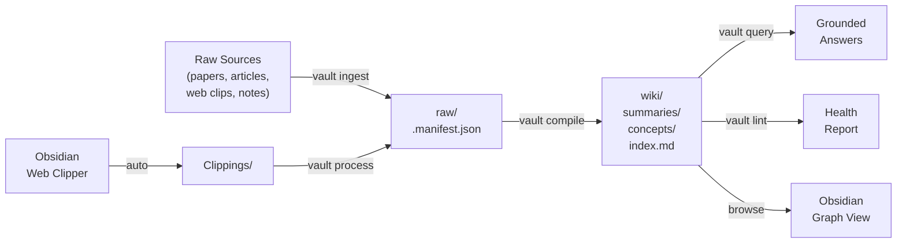

<p align="center">
  <h1 align="center">Claude Knowledge Vault</h1>
  <p align="center">
    <strong>A local, LLM-powered knowledge base for any project.</strong>
    <br />
    Ingest sources. Compile a wiki. Query your knowledge. Browse in Obsidian.
  </p>
  <p align="center">
    <a href="LICENSE"></a>
    <a href="https://docs.anthropic.com/en/docs/claude-code"></a>
    <a href="https://obsidian.md"></a>
  </p>
</p>

<br />

> Built on ideas from [Andrej Karpathy's LLM knowledge base approach](https://x.com/karpathy/status/1906365823148564901) and the [agno-agi/pal](https://github.com/agno-agi/pal) architecture.

<br />

## What It Does

Knowledge Vault is a [Claude Code](https://docs.anthropic.com/en/docs/claude-code) skill that turns any project directory into a structured knowledge base.



**Claude maintains all wiki content. You browse and query — never edit directly.**

<br />

## Install

```bash
git clone https://github.com/Psypeal/claude-knowledge-vault.git ~/.claude/skills/knowledge-vault
```

No config. No dependencies. No API keys. Just clone and go.

<br />

## Quick Start

```
> vault init
  Vault initialized at .vault/

> vault ingest https://arxiv.org/abs/1706.03762
  Ingested "Attention Is All You Need" as raw/attention-is-all-you-need.md

> vault compile
  Compiled 1 source. Extracted 4 concepts:
  self-attention, positional-encoding, multi-head-attention, transformer-architecture

> vault query How does self-attention handle variable-length sequences?
  Based on the vault: Self-attention computes pairwise relationships between all
  positions in parallel, making it inherently length-agnostic...
  Sources: [[attention-is-all-you-need]]
```

<br />

## Commands

| Command | Description |
|:--------|:------------|
| **`vault init`** | Initialize a `.vault/` knowledge base in the current project |
| **`vault ingest <source>`** | Add a raw source — URL, pasted text, or file path |
| **`vault compile`** | Compile pending sources into wiki summaries and concept articles |
| **`vault lint`** | Run 7 health checks on the wiki |
| **`vault query <question>`** | Ask a question grounded in your vault's knowledge |
| **`vault process`** | Batch: ingest all web clips + compile everything |
| **`vault status`** | Print a quick status summary |

<br />

## Project Structure

After `vault init`:

```
your-project/
  .vault/
  ├── Clippings/          Obsidian Web Clipper default folder
  ├── raw/                Ingested sources with YAML frontmatter
  │   └── .manifest.json  Source registry
  ├── wiki/
  │   ├── index.md        Master routing index
  │   ├── concepts/       One article per topic (200-500 words)
  │   ├── summaries/      One summary per source
  │   ├── outputs/        Query results and lint reports
  │   └── .state.json     Compilation and lint state
  └── templates/          Frontmatter skeletons
```

<br />

## Obsidian Frontend

Open `.vault/` as an Obsidian vault. Zero configuration needed.

<table>
  <tr>
    <td><strong>Graph View</strong></td>
    <td>Visualize concept connections via <code>[[wikilinks]]</code></td>
  </tr>
  <tr>
    <td><strong>Backlinks</strong></td>
    <td>See every article referencing a concept</td>
  </tr>
  <tr>
    <td><strong>Search</strong></td>
    <td>Full-text search across all articles</td>
  </tr>
  <tr>
    <td><strong>Tags</strong></td>
    <td>Browse by YAML tags across all sources</td>
  </tr>
  <tr>
    <td><strong>Web Clipper</strong></td>
    <td>Clip from browser &#8594; auto-lands in <code>Clippings/</code> &#8594; <code>vault process</code></td>
  </tr>
</table>

<br />

## 3-Tier Query Routing

Queries stay efficient at any vault size. Claude never loads everything — it reads the index, picks what's relevant, and drills down only when needed.

```
Tier 1  ─────  wiki/index.md           Always read first (one-line per entry)
                    │
Tier 2  ─────  summaries/ + concepts/  Read relevant matches (200-500 words each)
                    │
Tier 3  ─────  raw/                    Full source text (only when depth needed)
```

<br />

## Lint Checks

`vault lint` runs 7 health checks to keep your knowledge base consistent:

| Check | What it catches | Severity |
|:------|:----------------|:---------|
| **Contradictions** | Conflicting claims across different sources | Critical |
| **Stale articles** | Concepts not updated after new sources added | Warning |
| **Missing concepts** | Referenced via `[[wikilink]]` but no article exists | Warning |
| **Orphaned articles** | Concept articles with no sources linked | Warning |
| **Thin articles** | Concept articles under 100 words | Suggestion |
| **Duplicates** | Overlapping concept coverage | Warning |
| **Gap analysis** | Missing topics that would strengthen the knowledge graph | Suggestion |

<br />

## File Format

All files use YAML frontmatter + Markdown — fully Obsidian-compatible:

```yaml
---
title: "Attention Is All You Need"
source: "https://arxiv.org/abs/1706.03762"
type: paper                              # paper | article | repo | dataset
ingested: "2026-04-03T14:22:00Z"        #   meeting | notes | clip
tags: [transformers, attention]
compiled: false
---

Content body here.
```

<br />

## Comparison

| | **Knowledge Vault** | **[agno-agi/pal](https://github.com/agno-agi/pal)** |
|:---|:---|:---|
| **Runtime** | Claude Code (your terminal) | FastAPI + Docker |
| **Storage** | Markdown + JSON | PostgreSQL + files |
| **Setup** | `git clone` one folder | Docker Compose + API keys |
| **Scope** | Per-project | Global personal agent |
| **Dependencies** | None | PostgreSQL, OpenAI API |

<br />

## Requirements

- [Claude Code](https://docs.anthropic.com/en/docs/claude-code) v2.0+
- `python3` (for JSON updates in helper scripts)
- [Obsidian](https://obsidian.md) *(optional, for browsing)*

<br />

## Credits

- [Andrej Karpathy](https://x.com/karpathy/status/1906365823148564901) — LLM knowledge base compilation concept
- [agno-agi/pal](https://github.com/agno-agi/pal) — manifest tracking, YAML schemas, linting architecture

## License

[MIT](LICENSE)
